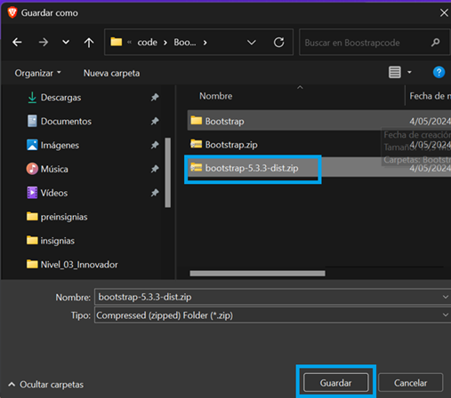

# Taller básico sobre uso de bootstrap

## ¿Qué es Bootstrap?

**Bootstrap** Es un marco de trabajo [Framework](#¿qué-es-framework) de código abierto utilizado para el desarrollo de sitios web y aplicaciones web. 

Fue creado por Twitter y lanzado como un proyecto de código abierto en 2011. 

Bootstrap proporciona un conjunto de herramientas y componentes front-end (HTML, CSS y JavaScript) predefinidos que facilitan la creación de interfaces de usuario consistentes, responsivas y visualmente atractivas.

## ¿Qué es Framework?

 "_Un conjunto de herramientas y reglas que hacen más fácil y rápido construir cosas más grandes al proporcionar piezas predefinidas que se pueden usar y ensamblar según sea necesario_".


[Ir a sitio web bootstrap](https://getbootstrap.com/)

## ¿Qué es la grilla o grid de bootstrap?

La **grilla** o **grid de Bootstrap** es una especie de estructura invisible que ayuda a organizar y distribuir el contenido en una página web. Piensa en ella como una cuadrícula en la que puedes colocar diferentes elementos, como imágenes, texto y botones, para que se vean bien y estén ordenados en diferentes tamaños de pantalla, como computadoras de escritorio, tabletas o teléfonos móviles.

Se divide en **12 columnas**. Puedes decidir cuántas columnas ocupará cada elemento en función de la pantalla en la que se esté viendo el sitio. 

Por ejemplo, en una pantalla grande, un elemento puede ocupar 4 columnas, dejando espacio para otros elementos al lado. Pero en una pantalla más pequeña, ese mismo elemento podría ocupar todas las 12 columnas para que se vea bien en un espacio más limitado.

## Instalar bootstrap usando CDN

### Agregar hoja de estilos en sección &lt;header&gt;

```javascript
    <link href="https://cdn.jsdelivr.net/npm/bootstrap@5.3.3/dist/css/bootstrap.min.css" rel="stylesheet" integrity="sha384-QWTKZyjpPEjISv5WaRU9OFeRpok6YctnYmDr5pNlyT2bRjXh0JMhjY6hW+ALEwIH" crossorigin="anonymous">
```

### Agregar script al final del &lt;body&gt;

```javascript
    <script src="https://cdn.jsdelivr.net/npm/bootstrap@5.3.3/dist/js/bootstrap.bundle.min.js" integrity="sha384-YvpcrYf0tY3lHB60NNkmXc5s9fDVZLESaAA55NDzOxhy9GkcIdslK1eN7N6jIeHz" crossorigin="anonymous"></script>
```

## Instalar bootstrap descargando y vinculando sus fuentes

### Haz clic en el enlace Download y luego en el botón Download
Paso 1


Paso 2


### Selecciona una carpeta de tu preferencia, y haz clic en el botón guardar

Al momento de elaborar esta guia, la versión disponible es **-5.3.3**, y el nombre del archivo es: **bootstrap-5.3.3-dist.zip**

### Descomprime el archivo, copia y pega las carpetas css y js en tu directorio de trabajo

Paso 1



Paso 2


Paso 3


Paso 4


Paso 5


## Ejercicio 1: plantilla básica usando CDN(Requiere acceso a internet)

[Archivo base 1_boostrap.html](1_bootstrap/1_boostrap.html)

* Crear directorio 1_bootstrap

* Crear Archivo 1_boostrap.html

* Vincular hoja de estilos de boostrap

* Vincular script de boostrap


## Ejercicio 2: plantilla básica usando bootstrap de forma local(No requiere acceso a internet) 

[Archivo base 2_boostrap.html](2_bootstrap/2_boostrap.html)

* Crear directorio 2_bootstrap

* Crear Archivo 2_boostrap.html

* Vincular hoja de estilos bootstrap.min.css de boostrap Este archivo debería estar en la carpeta css de nuestro proyecto

* Vincular archivo de script bootstrap.bundle.min.js de boostrap. Este archivo debería estar en la carpeta js de nuestro proyecto


## Ejercicio 2: Botones

[Archivo base 3_botones.html](3_botones/3_botones.html)

Paso 1

Agregar un div que tenga la clase de boostrap **_'container'_** 
El &lt;div&gt; debe contener al &lt;h1&gt;, al &lt;p&gt; y a los &lt;button&gt;
```html    
<div class="container">
	<h1>Información Personal</h1>
	<p>texto.....</p>
	<button>Boton 1<button>
	<button>Boton 2<button>
	<button>Boton 3<button>
	<button>Boton 4<button>
	<button>Boton 5<button>
	<button>Boton 6<button>
</div>
```
Paso 2 

Agregar etiquetas html &lt;button&gt;  y ccs de boostrap para
crear 6 botones.

Ir a la línea del documento 3_botones.html, ubicar el comentario:

```html
<!--Agregar 6 botones aqui--> 
```
Los botones deben incluir clases para estilizar botones de boostrap
como: btn, btn-primary y otros

[Boostrap botones](https://getbootstrap.com/docs/5.3/components/buttons/)

## Ejercicio 3: Plantilla básica

[Archivo base 4_plantilla.html](4_plantilla/4_plantilla.html)

**Documentación**

* [Boostrap grid](https://getbootstrap.com/docs/5.3/layout/grid/)

* [Boostrap breakpoints](https://getbootstrap.com/docs/5.3/layout/breakpoints/)

**Reglas**

* Todo nuestro contenido lo agregamos dentro de contenedores.
Clase css Bootstrap **'container'**, **'container-fluid'**
* Dentro del contenedor tendremos filas clase css Bootstrap **'row'**
* Dentro de las filas tendremos columnas clase css Bootstrap **col**

```html
 <!-- El container es el contenedor principal, en el iran todas las filas y columnas -->
    <!-- Con el container podemos centrar nuestra pagina -->
    <div class="container">
      <!-- Las filas (row) son grupos HORIZONTALES de columnas-->

      <!-- Los tamaños de Columna en Bootsrap 5 son:
			.col 		Extra Pequeño (Extra Small) - Smartphones Vertical		Menos de 576px
			.col-sm 	Pequeño (Small) - Smartphones Vertical	 				Mas de 576px y Menos de 768px
			.col-md 	Mediano (Medium) - Tablets 								Mas de 768px y Menos de 992px
			.col-lg 	Largo (Large) - Computadoras							Mas de 992px y Menos de 1200px
			.col-xl 	Extra Largo (Extra Large) - Computadoras				Mas de 1200px
			.col-xxl 	Extra Extra Largo (Extra Extra Large) - Televisiones 	Mas de 1400px
		-->
```

**Pasos**

* Crear directorio 4_plantilla
* Crear Archivo 4_plantilla.html
* Vincular hoja de estilos de boostrap
* Vincular script de boostrap
* Agregar un div con la clase 'container'
* Dentro del div **contenedor** agregar un div con la clase css **'row'**
* Dentro del div **'row'** agregar un div con la clase css **'col'** para adicionar columnas.
  
```html
<div class="row">
        <div class="col">
          <h1>Hola Mundo</h1>
          <p>
            Lorem ipsum dolor sit amet consectetur adipisicing elit. Dolores
            odio nihil deleniti aperiam magni laudantium delectus, dolor dolorum
            odit assumenda fuga commodi, harum rem nobis similique quasi vel
            suscipit a!
          </p>
          <button class="btn btn-primary">Ver Más</button>
        </div>
      </div>
    </div>
```

* Crear 3 filas con sus respectivas columnas: copia y pega el cósigo anterior 2 veces mas...
* Agrega tus propios estilos a tu página: incluye la sección style al incio del body
```css
<style>
  .row > div {
    background: #f2f2f2;
    margin: 10px 0;
    padding: 40px;
  }
</style>
```
